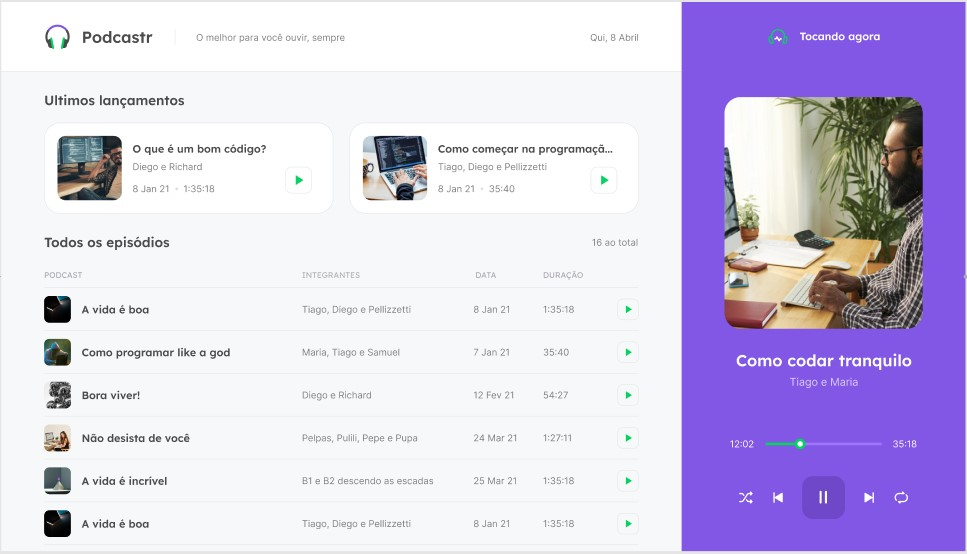

# Podcastr-Front
Criação de um Podcast com a mentoria de Jakeliny da Rocketseat. 
<h1 align="center">
  
</h1> 

  <a href="#-technologies">Technologies</a>&nbsp;&nbsp;&nbsp;|&nbsp;&nbsp;&nbsp;
  <a href="#-project">Project</a>&nbsp;&nbsp;&nbsp;|&nbsp;&nbsp;&nbsp;
  <a href="#-layout">Layout</a>&nbsp;&nbsp;&nbsp;|&nbsp;&nbsp;&nbsp;
  <a href="#memo-license">License</a>

 

 

  

 

 

  

## 🚀 Technologies

This project was developed with the following technologies:

- HTML
- CSS

## 💻 Project

Podcast is audio content, made available through a file or streaming, which has the advantage of being listened to on demand, whenever the user wishes. It can be heard on different devices, which has helped its popularity, and it usually addresses a specific subject to build a loyal audience. 

## How to use?

Download this repositorie and with your teminal, enter in the directory

1. Open this project with your favorite editor;
2. After, install de Live Server extansion; 
3. And, open the index.html with the Live Server to see the project.

## 🔖 Layout

You can see the layout of the project at [this link](https://www.figma.com/file/SGXQteG6GDYOchB51jFmzQ/Podcastr?node-id=196629%3A1). It's necessary have an account at [Figma](https://figma.com) to access it.

## :memo: License

This project is under MIT license. See the file [LICENSE](.github/LICENSE.md) for more details.

---

Made with 
